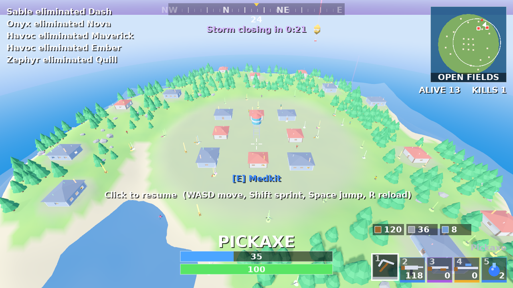

# Storm Island

A third-person battle-royale prototype for **PC (Windows / Linux) and Android**, built with
**Godot 3.5** and **Blender** (all models are generated by a script).

Last one standing wins: land on the island, grab loot, fight 14-24 bots, and stay inside the
shrinking storm.

| Town (aerial) | Android touch UI |
|---|---|
|  |  |

> Everything here is original: names, models, map and UI. No Epic Games / Fortnite assets or branding.

## Controls

| | PC | Gamepad | Android |
|---|---|---|---|
| Move | WASD | left stick | floating left-thumb joystick |
| Look | mouse | right stick | drag the right side of the screen |
| Fire (auto) | left mouse | R1 / right trigger | FIRE button (drag on it to aim) |
| Jump | Space | A | JUMP |
| Sprint | Shift | L3 | SPRINT toggle, or push the stick fully |
| Reload | R | X | RELOAD |
| Release mouse | Esc | | |

All input goes through one layer (`scripts/Controls.gd`): keyboard, gamepad and the on-screen
touch controls all become the same `InputMap` actions, so gameplay code is identical on every
platform. Touch controls appear automatically on Android, on a touchscreen, or with `-- --touch`.

## Cross-platform notes

* **Renderer:** GLES3 with automatic fallback to GLES2 for older Android GPUs.
* **Quality profile** (`World._make_profile`): on mobile (`OS.has_feature("mobile")`, or
  `-- --mobile` on desktop) there are 14 bots instead of 24, ~170 trees instead of ~420, no
  real-time shadows and a coarser terrain grid.
* **UI** uses `stretch mode 2d / aspect expand`, so the HUD is anchored and scales from 16:9
  desktop windows to 20:9 phones.
* Landscape orientation, immersive mode, ETC/ETC2 texture import enabled for Android.

## Project layout

```
project.godot, export_presets.cfg     Godot project + Android / Windows / Linux presets
scenes/Main.tscn                      one node: the World script builds everything else
scripts/World.gd                      island, buildings, props, loot, spawns, match flow
scripts/Terrain.gd                    noise heightmap, flat zones, vertex colours, collider
scripts/Fighter.gd                    shared health/shield, model animation, hitscan rifle
scripts/Player.gd, Bot.gd             third-person controller / bot AI
scripts/Storm.gd, Loot.gd             shrinking zone / pickups
scripts/HUD.gd, scripts/ui/*          HUD, minimap, crosshair, touch controls
tools/blender/generate_assets.py      builds assets/models/*.glb (run with Blender)
tests/smoke_test.gd                   headless gameplay test + screenshots
```

## Run it

1. Install [Godot 3.5.2](https://godotengine.org/download/archive/3.5.2-stable/) (standard build, not .NET).
2. Open the project once in the editor (imports the `.glb` models and font), then press **F5**.

Headless / CI: `godot --path . --editor --quit` imports assets; `tools/run_tests.sh` runs the smoke test
(`tools/run_tests.sh phone` for the Android profile at 2400x1080).

## Rebuild the Blender assets

```
blender -b -P tools/blender/generate_assets.py     # needs Blender 4.x with the glTF add-on
```

Writes the character (pivoted limbs for animation), rifle, houses, water tower, tree, rock and
loot crate to `assets/models/`.

## Build for Android

Needs the Godot 3.5.2 export templates, the Android SDK and a debug keystore.

* **Your own machine:** `tools/setup_android.sh` (keystore + the Editor Settings to fill in), install the
  templates from the editor, then `godot --path . --export-debug "Android" build/android/StormIsland-debug.apk`.
* **Locked-down box / cloud sandbox** (godotengine.org and GitHub releases blocked, Docker Hub reachable):
  `tools/fetch_export_toolchain.sh` pulls the templates + Android SDK out of the public
  `barichello/godot-ci:3.5.2` image and configures signing; then `tools/build_android.sh`.
* **CI:** `.github/workflows/build.yml` exports Android, Windows and Linux with that same image
  (not yet run on GitHub).

Install with `adb install -r build/android/StormIsland-debug.apk`. The APK is debug-signed; make a release
keystore before publishing anywhere.

## Linux build + screenshot tests

`tools/test_linux_build.sh` exports the **"Linux Test"** preset (a normal Linux build that also packs
`tests/`) and runs the smoke test from the exported binary under Xvfb, saving screenshots to
`tests/out/linux-build/`. The normal "Linux/X11" preset leaves the tests out.

## Status / not done yet

* Verified: the headless smoke test passes (movement, shooting, reload, kills, loot, storm damage,
  bot AI, touch input) on the desktop profile at 1280x720 and the mobile profile at 2400x1080.
* **Not verified:** an actual Android APK build or on-device run, and real gamepad input.
* No audio, no building/crafting, no vehicles, no drop-from-the-sky intro; bots use simple steering
  rather than a navmesh.
