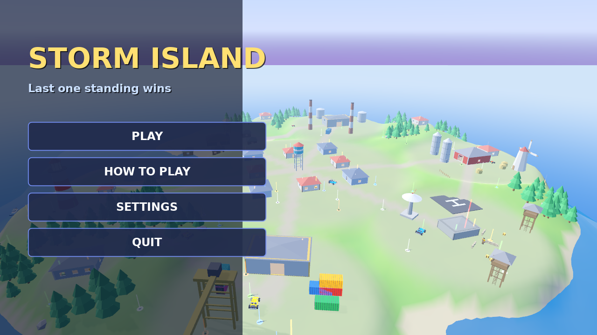
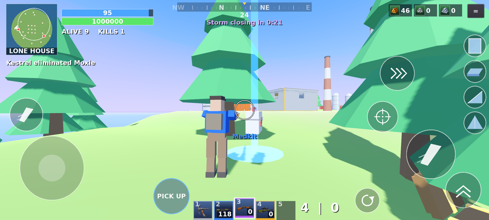
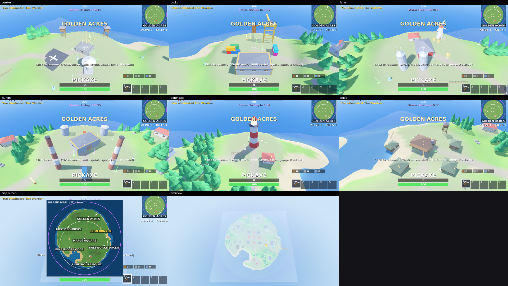
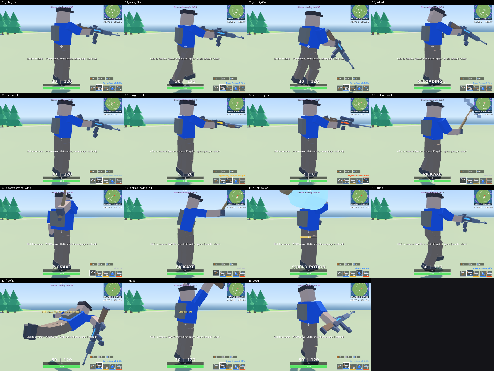

# Storm Island

A complete third-person battle-royale game for **PC (Windows / Linux) and Android**, built with
**Godot 3.5** and **Blender**. Every model is generated by a script and every sound and music track is
synthesised from code: there are no third-party assets and no Epic Games / Fortnite content.

Ride the Sky Ferry, drop onto the island, loot, build, drive, swim and fight 14-24 bots while the
storm closes in. Last one standing wins.

| Title screen | HUD on a phone |
|---|---|
|  |  |

## Features

| | |
|---|---|
| **Match flow** | Battle bus -> jump -> freefall -> glider -> land, shrinking storm in 5 phases, supply drops, last-one-standing win / elimination screen, title / pause / settings menus |
| **Combat** | 5 weapon types (pistol, SMG, assault rifle, pump shotgun, bolt sniper) with detailed models, recoil, reloads, headshots, pickaxe melee; tracers; hit markers |
| **Rarity** | Common / Uncommon / Rare / Epic / Legendary / **Mythic** (faster, bigger mags, tighter spread). Weapons carry a rarity-coloured accent and loot beam |
| **Inventory** | 5-slot hotbar (pickaxe + 4), heal & shield consumables with use timers (Bandage, Mini Shield, Medkit, Shield Potion, Slurp Juice, Chug Jug), throwable **Grenades**, 4 ammo types, materials counter; a Tab inventory screen (details, resources, ammo, equipment; X drops); a full inventory swaps the picked-up item for the one in hand |
| **Loot** | Floor loot with beams, 4 container types: treasure chest, ammo box, falling **supply drop**, bunker **vault** |
| **POIs** | A 480 m island with 13 named places: Maple Square, Saltworks Docks, Pine Ridge Lodge, Rusty Foundry, Golden Acres, Iron Bunker, Lighthouse Point, Blackwater Marina, Windmill Hollow, Granite Quarry, Ember Mesa, Frostbite Flats, Crescent Cove; roads between them; a full-screen map (M) with every name and the vehicles |
| **Boss** | *The Warden* guards Iron Bunker (300 hp + shield) with a Mythic weapon |
| **Movement** | Sprint, jump, **crouch** and **slide** (crouch while sprinting), **mantling** ledges, **swimming** (floating, strokes, ripples), freefall dive, glider, hard landings hurt (fall damage), a dance **emote** (B) |
| **Vehicles** | Buggy (2 seats), quad bike, motor boat; run-over and crash damage, explosions, horn |
| **Building** | Walls, floors, ramps and roofs in wood / stone / metal on a 4 m grid, destructible, **editable** (G: cut doors, windows and holes in walls and floors on a 3x3 grid), harvested from trees / rocks / structures with the pickaxe, with a draining health bar over whatever you are hitting |
| **Animation** | Jointed rig: idle breathing, walk / run / sprint cycles, landing squash, aim + recoil, reload, pickaxe wind-up, drinking, swimming strokes, mantle, vehicle seat, skydive, glide |
| **Audio** | 71 synthesised sound effects (per-weapon shots, footsteps per surface, water, chests, rarity chimes, storm, engines...) and 6 music tracks (menu, bus, ambient, combat, victory, defeat) with crossfades |
| **Platforms** | Keyboard + mouse, gamepad, and full touch controls; mobile quality profile |




## Controls

| | PC | Gamepad | Android |
|---|---|---|---|
| Move / look | WASD / mouse | sticks | floating joystick / drag right side |
| Fire (auto) | left mouse | R2 | big FIRE button right, or the second FIRE above the joystick (drag on either to aim) |
| Jump, drop from bus, glider, handbrake | Space | A | JUMP |
| Sprint | Shift | L3 | SPRINT toggle / push stick fully |
| Aim down sights | right mouse (hold) | L2 | scope button (tap to toggle) |
| Reload / horn | R | X | reload button beside the ammo readout |
| Pick up (swaps the item in hand when full), open, enter / exit vehicle | E | Y | PICK UP / EXIT (appears when relevant) |
| Inventory screen (X drops) | Tab | Select | bag button (top right) |
| Items | 1-4 / wheel, F = pickaxe | L1 / R1 | tap the slots |
| Crouch / slide, emote | Ctrl, B | R3, D-pad up | |
| Build mode | Q, or Z X C V for wall / floor / ramp / roof (wheel: material) | | the four piece buttons down the right edge (tap again to leave); tap a materials box to pick wood / stone / metal |
| Map | M | | tap the minimap |
| Pause | Esc | | II button / Back |

The phone HUD is its own layout (minimap, shield / health bars and kill feed top-left, materials and menu
top-right, hotbar bottom-centre with ammo and reload beside it, fire / jump / sprint on the right); the PC HUD
is unchanged. See `HUD._layout()` and `scripts/ui/TouchControls.gd`.

All input goes through `scripts/Controls.gd`: keyboard, gamepad and touch controls produce the same
`InputMap` actions, so gameplay code is identical on every platform.

## Project layout

```
project.godot, export_presets.cfg      Godot project + Android / Windows / Linux (+ "Linux Test") presets
scenes/Main.tscn                       one node: World.gd builds everything else
scripts/World.gd                       island, POIs, props, loot, spawns, bus, match flow, ambience, music
scripts/Terrain.gd  Pois.gd            noise island, flat pads, roads / named POI layouts
scripts/Fighter.gd  Player.gd  Bot.gd  shared combat + inventory + movement states, player controller, bot AI
scripts/Animator.gd                    procedural full-body animation for the jointed rig
scripts/Items.gd                       items, rarities, weapons, loot tables
scripts/Chest.gd LootItem.gd Bus.gd Storm.gd BuildPiece.gd Builder.gd Vehicle.gd Boat.gd VehicleCommon.gd
scripts/Audio.gd Settings.gd Controls.gd Menu.gd HUD.gd  autoloads + UI;  scripts/ui/*  HUD widgets, touch controls, map
tools/blender/generate_assets.py       builds every assets/models/*.glb
tools/audio/generate_audio.py          synthesises every assets/audio/*.wav
tests/*.gd                             headless test suites (below)
```

## Run it

1. Install [Godot 3.5.2](https://godotengine.org/download/archive/3.5.2-stable/) (standard build).
2. Open the project once in the editor (imports the models, audio and font), then press **F5**.

Headless: `tools/import_assets.sh` imports assets without a display.

## Tests

`tools/run_all_tests.sh` runs seven headless suites under Xvfb (`SHOTS=1` also writes screenshots to `tests/out/`):

| suite | covers |
|---|---|
| `smoke_test` | spawning, movement, weapons, reload, kills, loot, inventory, consumables, harvesting, chests, supply drop, storm, bots, touch input, audio events |
| `bus_test` | bus -> freefall -> glider -> landing, bots dropping, storm start, music changes |
| `movement_test` | sprint + FOV, mantle (accept / reject), swimming in / out |
| `vehicle_test` | buggy / quad / boat, passengers, run-over, destruction |
| `build_test` | build mode, costs, tiers, ramps, destroying pieces |
| `poi_test` | all POIs, boss, vault, mythic drop |
| `menu_test` | title, settings persistence, pause / resume |

`tests/anim_test.gd` and `tests/gallery_test.gd` render pose / model galleries; `tools/contact_sheet.py` stitches screenshots.

## Regenerate assets

```
blender -b -P tools/blender/generate_assets.py          # Blender 4.x, needs numpy for the glTF exporter
python3 tools/audio/generate_audio.py                   # numpy + scipy
tools/import_assets.sh                                  # re-import in Godot
```

## Build

**Linux test build** (runs the tests from the *exported* binary): `tools/test_linux_build.sh`.

**Android APK** needs the Godot 3.5.2 export templates, the Android SDK and a debug keystore:

* your own machine: `tools/setup_android.sh`, install the templates from the editor, then
  `godot --path . --export-debug "Android" build/android/StormIsland-debug.apk`
* locked-down box (godotengine.org / GitHub releases blocked, Docker Hub reachable):
  `tools/fetch_export_toolchain.sh` pulls the templates + Android SDK from the public
  `barichello/godot-ci:3.5.2` image, then `tools/patch_android_target_sdk.py` and `tools/build_android.sh`.

`tools/patch_android_target_sdk.py` raises the template's `targetSdkVersion` from 32 to **35**. Google Play
Protect blocks sideloaded apps that target more than two API levels below the phone's Android
version ("Unsafe app blocked ... built for an older version of Android").
`.github/workflows/build.yml` exports Android, Windows and Linux with the same image (not yet run on GitHub).

**Windows icon:** Godot only embeds `application/icon` when it can run rcedit (Wine). On a box without Wine run
`pip install lief pillow && tools/patch_windows_icon.py` once: it rewrites the icons inside the Windows export
template from `icon.png`, so every export shows the game's icon instead of the Godot logo.

The APK is debug-signed. Make a release keystore before publishing.

## Status

* Verified in a headless software renderer: all seven suites pass on the desktop profile; the smoke test also
  passes on the mobile profile at 2400x1080 with the touch UI.
* **Not verified:** on-device Android play (performance, touch feel, audio mix), real gamepads, and the
  GitHub Actions workflow. Sound design is synthesised and was checked numerically (levels, loop seams),
  not by ear.
* Not included: online multiplayer, building editing, emotes, vehicle fuel.
* The Android preset ships arm64 only (keeps the APK ~16 MB; every phone since ~2019 is 64-bit). Set `architectures/armeabi-v7a=true` in `export_presets.cfg` for 32-bit devices.
